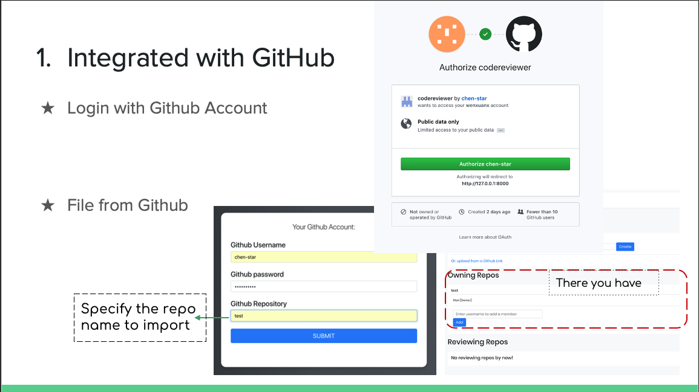
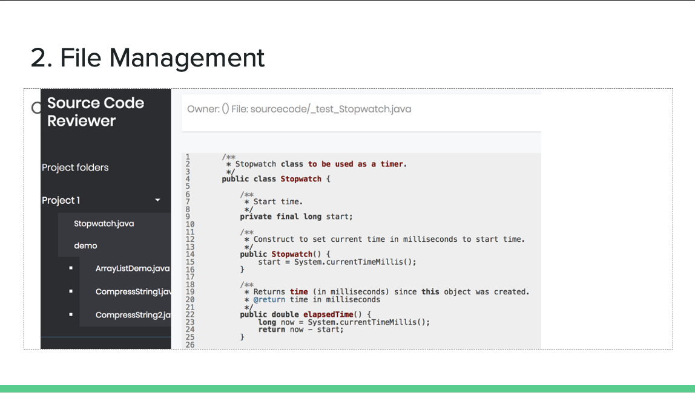
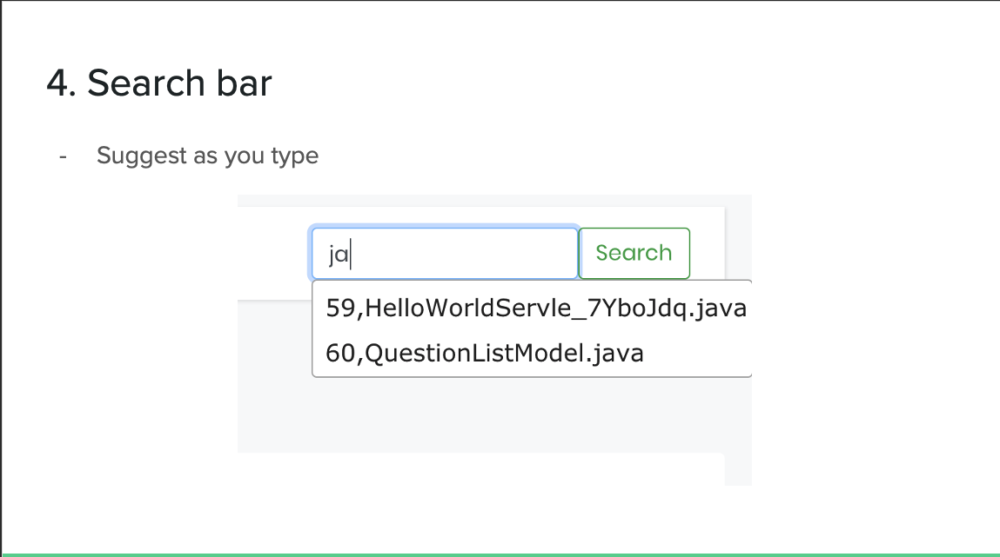

# Collaborative Source Code Review Platform

#### Django – based GitHub like code repository system

## Project Background

* Current Issues:
	- Reviewers lack the ability to record and share their thoughts.
	- GitHub does not support comment within a file.
	- Uploaded file will not be automatically reformatted if the original format of src doc is malformed.

* Goal of our project:
	- Provide a platform for code reviewers to collaborate and share code from large codebases. 
	- Upload source code or link of a GitHub repo
	- Code format and highlight according to language
Freely add contributor

## Functionalities

* Account authentication management
	- registration / login / Edit profile
	- Review Statistic Dashboard (visualized table)
* Code review
	- In-line comment
	- Auto-format file
	- Syntax highlight based on languages
* Repository Management
	- Upload project locally
	- Clone repository from a GitHub account
	- Search by keywords
	- Invitation of collaborators

## Demo

